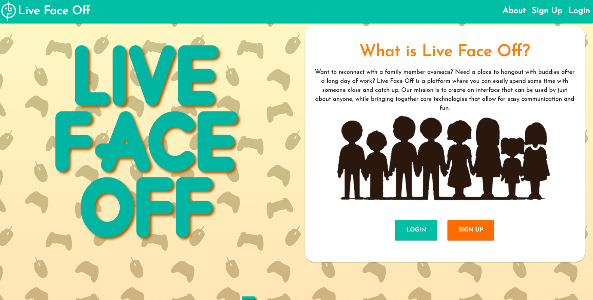
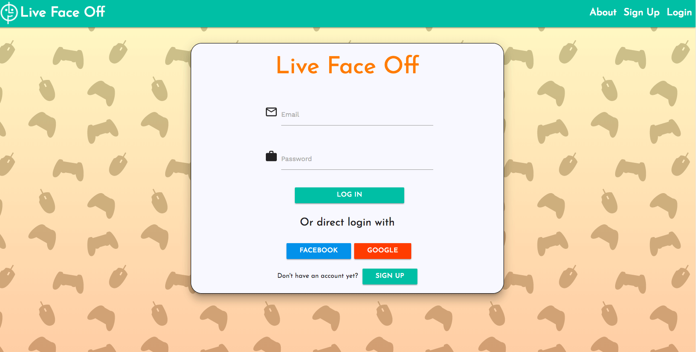
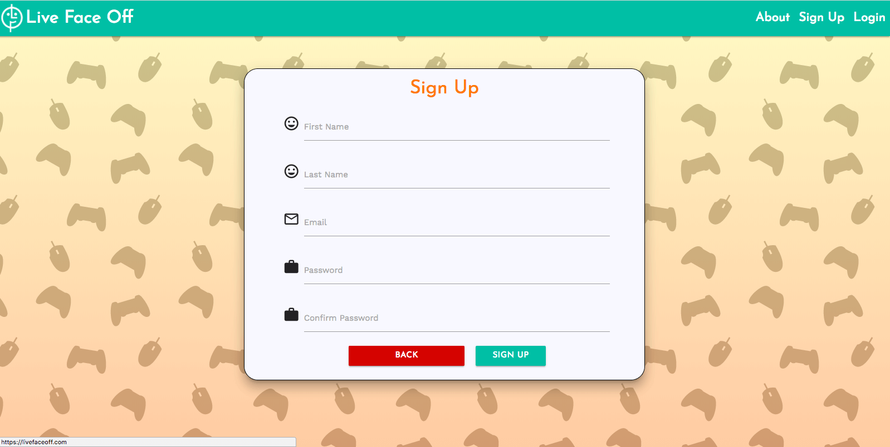
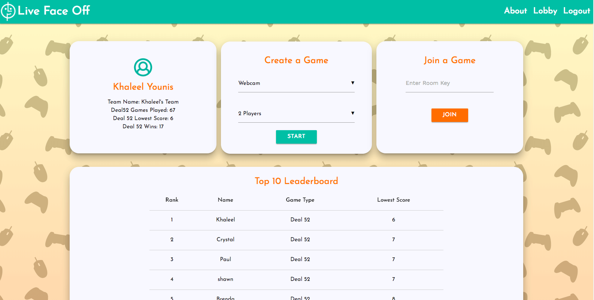

# Live Face Off
#### [View Live Site](http://livefaceoff.com)
Connect with your friends and family and enjoy some time with each other.

 | 
:-------------------------:|:-------------------------:

 | 
:-------------------------:|:-------------------------:

## Technologies Used

### Frontend

* ReactJS, 
* Redux, 
* Materialize CSS, 
* Axios, 
* Socket.io-client, 
* TokBox Web Cam API (WebRTC Technology) 

### Backend

* Node.js, 
* MongoDB (mlab), 
* Mongoose, 
* Express, 
* Passport.js (Google / Facebook / Local), 
* Socket.io, 
* JSON Web Token, 
* TokBox Web Cam API (WebRTC Technology)

## Tools Used

* Git
* GitHub
* MeisterTask

## Developers

* Khaleel Younis [GitHub](https://github.com/stallenvp)
* Shawn Levin [GitHub](https://github.com/slevin22)
* Paul Lee [GitHub](https://github.com/Fedrius)
* Crystal Navarro[GitHub](https://github.com/xoxocrystyle)
